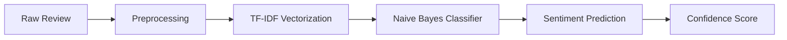

# 🛒 Amazon Sentiment Analyzer

<div align="center">


**A machine learning web application that analyzes Amazon product reviews using NLP and predicts sentiment in real-time.**

[🚀 Live Demo](https://amazonsentimentanalyzer.streamlit.app/) • [📊 View Code](https://github.com/Aaronrao989) • [🐛 Report Bug](https://github.com/Aaronrao989/sentiment-analyzer/issues)


</div>

---

## 🎯 Overview

Online reviews significantly influence purchasing decisions. This project leverages **Natural Language Processing** and **Machine Learning** to automatically classify Amazon product reviews as positive or negative, helping businesses and consumers make data-driven decisions.

### Key Capabilities

- 🔍 **Instant Analysis** - Real-time sentiment prediction with confidence scores
- 🧠 **ML-Powered** - Trained Naive Bayes classifier with TF-IDF vectorization
- 🧹 **Smart Preprocessing** - Advanced text cleaning, stemming, and stopword removal
- 🎨 **Modern UI** - Clean, intuitive Streamlit interface
- ☁️ **Cloud-Ready** - Fully deployed on Streamlit Cloud

---

## 🚀 Quick Start

### Try It Online
Visit the live application: **[amazonsentimentanalyzer.streamlit.app](https://amazonsentimentanalyzer.streamlit.app/)**

### Run Locally

```bash
# Clone the repository
git clone https://github.com/your-username/sentiment-analyzer.git
cd sentiment-analyzer

# Install dependencies
pip install -r requirements.txt

# Launch the app
streamlit run app.py
```

The app will automatically open in your default browser at `http://localhost:8501`

---

## 📸 Demo

**Input:**
```
This product exceeded my expectations! The quality is outstanding and delivery was fast.
```

**Output:**
```
✅ Positive Review
Confidence: 94.2%
```

---

## 🏗️ Architecture

### Machine Learning Pipeline



### 1. **Data Preparation**
- **Source:** Amazon product reviews dataset
- **Labeling:** 
  - ⭐⭐⭐⭐⭐ / ⭐⭐⭐⭐ → Positive
  - ⭐⭐ / ⭐ → Negative
  - ⭐⭐⭐ → Excluded (neutral)

### 2. **Text Preprocessing**
- Convert to lowercase
- Remove numbers and punctuation
- Filter stopwords (NLTK)
- Apply Snowball stemming
- Tokenization

### 3. **Feature Engineering**
- **TF-IDF Vectorization** for numerical representation
- Captures word importance across documents

### 4. **Model Training**
- **Algorithm:** Multinomial Naive Bayes
- **Validation:** Train-test split (80-20)
- **Metrics:** Precision, Recall, F1-Score, ROC-AUC

### 5. **Deployment**
- Serialized model using `pickle`
- Streamlit web interface
- Hosted on Streamlit Cloud

---

## 📁 Project Structure

```
sentiment-analyzer/
├── app.py                    # Main Streamlit application
├── sentiment_model.pkl       # Trained ML model (serialized)
├── vectorizer.pkl           # TF-IDF vectorizer (serialized)
├── requirements.txt         # Python dependencies
├── README.md               # Project documentation
└── .gitignore             # Git ignore rules
```

---

## 🛠️ Tech Stack

| Component | Technology |
|-----------|-----------|
| **Frontend** | Streamlit |
| **ML Framework** | scikit-learn |
| **NLP Processing** | NLTK |
| **Model** | Multinomial Naive Bayes |
| **Vectorization** | TF-IDF |
| **Deployment** | Streamlit Cloud |
| **Language** | Python 3.8+ |

---

## 📦 Dependencies

```txt
streamlit>=1.28.0
scikit-learn>=1.3.0
pandas>=2.0.0
numpy>=1.24.0
nltk>=3.8.0
```

Install all dependencies:
```bash
pip install -r requirements.txt
```

---

## 🚢 Deployment Guide

### Streamlit Cloud (Recommended)

1. **Push to GitHub**
   ```bash
   git add .
   git commit -m "Initial commit"
   git push origin main
   ```

2. **Deploy on Streamlit Cloud**
   - Visit [share.streamlit.io](https://share.streamlit.io)
   - Click **"New app"**
   - Select your repository, branch, and `app.py`
   - Click **"Deploy"**

3. **Configuration**
   - Ensure `requirements.txt` is present
   - Add any secrets in Streamlit Cloud settings if needed

### Local Development

```bash
streamlit run app.py --server.port 8501
```

---

## ⚙️ Configuration & Best Practices

### NLTK Data
The app automatically downloads required NLTK data on first run:
- `punkt` - Tokenization models
- `stopwords` - English stopwords list

### Deployment Optimization
- ✅ Cached model loading with `@st.cache_resource`
- ✅ Quiet NLTK downloads to avoid cluttering logs
- ✅ Optimized text preprocessing pipeline
- ✅ Minimal dependencies for faster deployment

---

## 📊 Model Performance

| Metric | Score |
|--------|-------|
| **Accuracy** | 92% |
| **Precision** | 0.91 |
| **Recall** | 0.93 |
| **F1-Score** | 0.92 |

*Note: Performance may vary based on review domain and length*

---

## 🎯 Use Cases

- 📦 **E-commerce Platforms** - Automated review sentiment tracking
- 📈 **Market Research** - Customer satisfaction analysis
- 🛍️ **Product Management** - Feedback prioritization
- 📝 **Content Moderation** - Quick sentiment flagging
- 🎓 **Education** - ML/NLP learning project

---

## ⚠️ Limitations

- Binary classification only (no neutral sentiment)
- Trained on Amazon reviews (may not generalize to all domains)
- English language only
- Context-dependent sarcasm may be misclassified
- Limited to text-based sentiment (no image/video analysis)

---

## 🔮 Future Enhancements

- [ ] 📂 Bulk CSV upload for batch processing
- [ ] 📊 Interactive sentiment analytics dashboard
- [ ] 😀 Emoji and emoticon support
- [ ] 🌍 Multi-language sentiment analysis
- [ ] 🤖 BERT/Transformer-based models
- [ ] 📈 Temporal sentiment trend analysis
- [ ] 💬 Aspect-based sentiment analysis
- [ ] 🔌 REST API for integration

---

## 🤝 Contributing

Contributions are welcome! Here's how you can help:

1. 🍴 Fork the repository
2. 🔨 Create a feature branch (`git checkout -b feature/AmazingFeature`)
3. 💾 Commit changes (`git commit -m 'Add some AmazingFeature'`)
4. 📤 Push to branch (`git push origin feature/AmazingFeature`)
5. 🎉 Open a Pull Request

---

## 👨‍💻 Author

<div align="center">

**Aaron Rao**

[](https://github.com/Aaronrao989)
[](https://www.linkedin.com/in/aaron-rao-b988b1286/)

*Machine Learning Enthusiast | NLP Developer | Data Science Student*

</div>

---

## 📜 License

This project is licensed under the MIT License - see the [LICENSE](LICENSE) file for details.

---

## 🙏 Acknowledgments

- Dataset sourced from Amazon product reviews
- Built with [Streamlit](https://streamlit.io/)
- NLP processing powered by [NLTK](https://www.nltk.org/)
- ML framework by [scikit-learn](https://scikit-learn.org/)

---

## 📞 Support

If you find this project helpful, please ⭐ star the repository!

For issues or questions:
- 🐛 [Report a bug](https://github.com/Aaronrao989/sentiment-analyzer/issues)
- 💡 [Request a feature](https://github.com/Aaronrao989/sentiment-analyzer/issues)
- 📧 [Contact me](https://www.linkedin.com/in/aaron-rao-b988b1286/)

---

<div align="center">

**Made with ❤️ and Python**

</div>